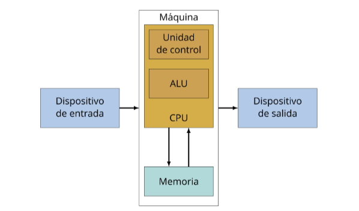
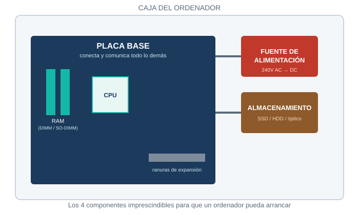
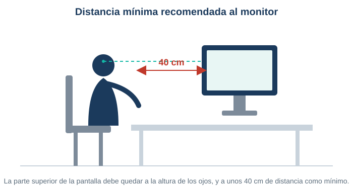

# Tema 1 — Caracterización de los sistemas informáticos

[← Volver al Bloque 1](../README.md)

---

## Índice

1. [Introducción](#1-introducción)
2. [Arquitecturas de ordenadores](#2-arquitecturas-de-ordenadores)
3. [Componentes de un sistema informático](#3-componentes-de-un-sistema-informático)
4. [Periféricos y conexión de dispositivos](#4-periféricos-y-conexión-de-dispositivos)
5. [Seguridad y prevención de riesgos](#5-seguridad-y-prevención-de-riesgos)

---

## 1. Introducción

Un ordenador procesa información siguiendo un ciclo de instrucciones (buscar → interpretar → ejecutar → guardar). Está construido con hardware físico (placa base, RAM, almacenamiento, fuente de alimentación) al que se conectan periféricos (teclado, ratón, impresora...). Todo esto se maneja con unas normas mínimas de seguridad, tanto para las personas como para los equipos.

En este tema vemos primero cómo se ha llegado a organizar internamente un ordenador (las arquitecturas), después de qué piezas físicas está hecho y cómo se le conectan dispositivos externos, y por último qué normas mínimas de seguridad hay que respetar al trabajar con ellos.

## 2. Arquitecturas de ordenadores

Una arquitectura es la forma en la que se organizan la memoria, el procesador y los datos dentro de un ordenador. Hay tres que hay que conocer.

### 2.1. La máquina de Turing (1936)

No es una máquina real, es una idea teórica que sirve para explicar qué significa "calcular algo con un algoritmo".

```
  cinta infinita:  [ 1 ][ 0 ][ 1 ][ _ ][ _ ][ ... ]
                          ▲
                     cabezal lee/escribe
                     y se mueve ← →
```

Consiste en una cinta infinita dividida en celdas, cada una con un símbolo. Un cabezal de lectura/escritura se mueve por la cinta y, según una tabla de reglas, en cada paso puede: escribir un símbolo, moverse a izquierda o derecha, y cambiar de estado. Repite esto hasta llegar a un estado de aceptación, rechazo o parada.

> Todo lo que hoy consideramos "computable" se puede reducir, en teoría, a una máquina de Turing. Por eso es tan importante en la historia de la informática, aunque nunca se construyera de verdad.

### 2.2. Arquitectura de Von Neumann (1945)

Es la que usan la mayoría de ordenadores actuales. Su característica principal: **instrucciones y datos comparten la misma memoria**.



**Componentes principales:**

| Componente | Función |
|---|---|
| CPU → Unidad de control (CU) | Interpreta las instrucciones y genera las señales que coordinan todo el ordenador |
| CPU → Unidad aritmético-lógica (ALU) | Hace las operaciones matemáticas y lógicas (sumas, restas, AND, OR...) |
| Memoria principal | Guarda a la vez instrucciones y datos, en celdas con dirección propia |
| Dispositivos de E/S | Entrada (teclado, ratón) y salida (monitor, impresora) |
| Bus del sistema | Bus de datos + bus de direcciones + bus de control: conecta y coordina todo lo anterior |

**Ciclo de instrucción** (se repite constantemente mientras el ordenador funciona):

| Paso | Nombre | Qué hace |
|---|---|---|
| 1 | Fetch (captura) | La CPU va a buscar la siguiente instrucción a la memoria |
| 2 | Decode (decodifica) | La unidad de control interpreta qué hay que hacer |
| 3 | Execute (ejecuta) | La ALU hace el cálculo o mueve datos |
| 4 | Store (guarda) | El resultado se guarda en memoria o en un registro |

**Ventajas y desventajas de Von Neumann:**

| Ventajas | Desventajas |
|---|---|
| Simple y fácil de implementar | Cuello de botella: datos e instrucciones compiten por el mismo bus, lo que limita la velocidad |
| Flexible: se puede cambiar el programa sin tocar el hardware | Riesgo de que un error escriba encima de una instrucción, ya que comparten memoria |

### 2.3. Arquitectura Harvard

La diferencia con Von Neumann: **memoria de instrucciones y memoria de datos separadas**, cada una con su propio bus. Así la CPU puede leer una instrucción y un dato a la vez.

Se usa sobre todo en microcontroladores, DSP (procesadores de audio/vídeo) y sistemas de tiempo real, donde la velocidad y la fiabilidad son críticas.

**Ventajas y desventajas de Harvard:**

| Ventajas | Desventajas |
|---|---|
| Más rápida: acceso simultáneo a instrucciones y datos | Diseño más caro y complejo |
| Menos conflictos de acceso a memoria | Puede desaprovechar recursos si sobra memoria de un tipo y falta del otro |
| Más fiable: un error en datos no afecta a las instrucciones | — |

### 2.4. Comparativa rápida

| | Turing | Von Neumann | Harvard |
|---|---|---|---|
| ¿Es real? | No, teórica | Sí | Sí |
| Memoria | Cinta infinita (teórica) | Una sola, compartida | Dos, separadas |
| Uso típico | Base teórica de la computación | PC, portátiles, servidores | Microcontroladores, DSP |

---

## 3. Componentes de un sistema informático

Hay 4 elementos imprescindibles para que un ordenador encienda y funcione: placa base, fuente de alimentación, almacenamiento y memoria RAM.



### 3.1. Placa base (motherboard)

El componente donde se conecta todo lo demás. Su función es transmitir los datos entre componentes.

| Formato | Tamaño aprox. | Uso típico |
|---|---|---|
| ATX | 305 × 330 mm | El más habitual |
| MicroATX | 244 × 244 mm | Equipos más compactos |
| MiniATX | 150 × 150 mm | Equipos muy reducidos |
| ITX | — | Equipos de altas prestaciones: diseño, gaming, servidores |

### 3.2. Fuente de alimentación

Transforma la corriente alterna (240V) en corriente continua para alimentar los componentes.

| Formato | Uso |
|---|---|
| ATX | PC de escritorio estándar |
| SFX | Mini-PC, más compacta |
| Formato servidor | Racks, soporta redundancia |

### 3.3. Almacenamiento

Ahí vive el sistema operativo y tus archivos.

| Tipo | Cómo funciona | Ejemplo |
|---|---|---|
| Magnético | Discos rígidos que giran, cabezal que lee/escribe | Disco duro (HDD) |
| Electrónico | Chips de memoria flash, sin partes móviles | SSD |
| Óptico | Láser sobre un disco | CD / DVD |

Los SSD están sustituyendo a los HDD: son más rápidos (hasta 600 MB/s por SATA), más fiables y más duraderos, al no tener partes móviles que se puedan desgastar.

### 3.4. Memoria RAM

La RAM es **volátil**: si apagas o reinicias el ordenador, se pierde todo lo que había en ella. Por eso no sirve para guardar archivos de forma permanente. Las memorias **RAM** más utilizadas actualmente son las DDR4. Es la tecnología más actual, capaz de trabajar a 4.600 MHz y con un almacenamiento de hasta 16 GB. 

| Tipo de ranura | Se usa en |
|---|---|
| DIMM | Equipos de sobremesa. Permite conectar memorias DDR, 1, 2, 3 y 4 |
| SO-DIMM | Portátiles y servidores (versión reducida de DIMM) |

---

## 4. Periféricos y conexión de dispositivos

Un periférico es un componente no imprescindible para que el ordenador funcione, pero útil para usarlo (teclado, ratón, impresora...).

| Tipo | Función | Ejemplos |
|---|---|---|
| Entrada | Meten información al ordenador | Teclado, ratón, micrófono, escáner |
| Salida | Sacan información del ordenador | Monitor, impresora, auriculares |
| Entrada/Salida | Las dos cosas a la vez | Pantalla táctil |
| Almacenamiento | Guardar y recuperar datos | Disco externo, USB, tarjeta SD |
| Comunicación | Conectar con otros equipos o redes | Tarjeta de red, módem, wifi |
| Especializados | Tareas concretas | Tableta gráfica, lector de huellas |

---

## 5. Seguridad y prevención de riesgos

Regulado por la **Ley 31/1995 de Prevención de Riesgos Laborales (LPRL)**, cuyo objetivo es proteger la salud y seguridad de los trabajadores.

**Riesgo laboral** (art. 4 LPRL): posibilidad de que un trabajador sufra un daño derivado del trabajo. Se valora combinando probabilidad de que pase + gravedad si pasa.

En caso de accidente, se actúa siempre con el protocolo **PAS**: **P**roteger (a ti y al accidentado), **A**visar (a los servicios de emergencia), **S**ocorrer (ayudar según tu formación).

### 5.1. Riesgos típicos de un informático

| Riesgo | En qué consiste |
|---|---|
| Ergonomía | Malas posturas → dolor de espalda, cuello, muñecas |
| Fatiga visual | Muchas horas de pantalla → sequedad, malestar ocular |
| Estrés mental | Plazos ajustados, carga de trabajo alta |
| Sedentarismo | Estar sentado muchas horas seguidas |
| Riesgo eléctrico | Manipular hardware sin cuidado |
| Ruido | Entornos con servidores u otros equipos ruidosos |
| Psicosocial | Aislamiento, poca interacción social |

### 5.2. Medidas preventivas

**Las 6 medidas preventivas principales:**

1. **Puesto ergonómico** — silla regulable, escritorio a buena altura, reposapiés, monitor a la altura de los ojos.
2. **Buena iluminación** — aprovechar luz natural, usar filtros antirreflejos.
3. **Prevenir fatiga visual** — regla 20-20-20: cada 20 min, mirar algo a 6 m durante 20 segundos.
4. **Gestión del estrés** — descansos regulares, repartir bien la carga de trabajo.
5. **Actividad física** — pausas activas, estiramientos.
6. **Seguridad eléctrica** — revisar los equipos periódicamente, formación en uso seguro.

La distancia mínima recomendada entre los ojos y el monitor es de 40 cm, con la parte superior de la pantalla a la altura de los ojos:



---

## Resumen del tema

| Concepto | Lo que hay que recordar |
|---|---|
| Von Neumann | Memoria compartida para datos e instrucciones. La usan la mayoría de PC actuales. |
| Harvard | Memorias separadas para datos e instrucciones → más rápida, más cara. |
| Ciclo de instrucción | Fetch → Decode → Execute → Store, se repite constantemente. |
| 4 componentes imprescindibles | Placa base, fuente de alimentación, almacenamiento, RAM. |
| RAM | Es volátil: se borra al apagar el equipo. |
| Periférico | No imprescindible, pero útil (teclado, ratón, impresora...). |
| PAS | Proteger, Avisar, Socorrer — protocolo ante un accidente. |
| Regla 20-20-20 | Cada 20 min, mirar 20 seg algo a 6 metros, para descansar la vista. |

---
