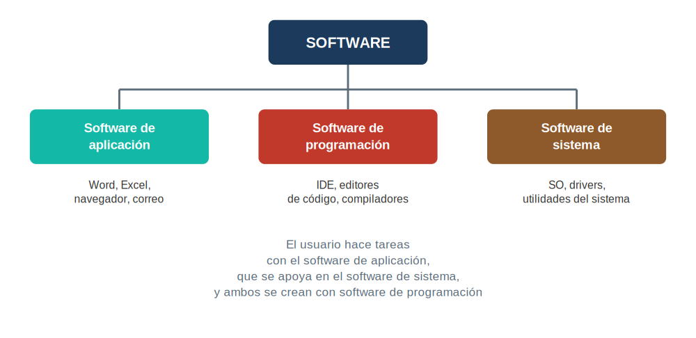

# Tema 2 — Explotación de aplicaciones

[← Volver al Bloque 1](../README.md)

---

## Índice

1. [Introducción](#1-introducción)
2. [Tipos de aplicaciones](#2-tipos-de-aplicaciones)
3. [Licencias](#3-licencias)
4. [Instalación y desinstalación de aplicaciones](#4-instalación-y-desinstalación-de-aplicaciones)
5. [Instalaciones desatendidas](#5-instalaciones-desatendidas)
6. [Actualización de sistemas operativos y aplicaciones](#6-actualización-de-sistemas-operativos-y-aplicaciones)
7. [Resolución de incidencias y asistencia técnica](#7-resolución-de-incidencias-y-asistencia-técnica)
8. [Manuales de instalación y configuración](#8-manuales-de-instalación-y-configuración)
9. [Herramientas ofimáticas y de productividad](#9-herramientas-ofimáticas-y-de-productividad)
10. [Otras herramientas](#10-otras-herramientas)

---

## 1. Introducción

En este tema vemos el proceso completo de instalar, mantener y actualizar software en un sistema informático: cómo se clasifican las aplicaciones, qué son las licencias y por qué hay que respetarlas, cómo se instala y desinstala software en Windows/macOS/Linux, qué son las instalaciones desatendidas, y cómo se documenta y resuelve una incidencia.

## 2. Tipos de aplicaciones

Las aplicaciones se clasifican en tres grandes categorías, según para qué sirven:

### 2.1. Software de aplicación

Pensado para que el usuario haga tareas concretas.

| Tipo | Ejemplos |
|---|---|
| Procesadores de texto | Microsoft Word, LibreOffice Writer |
| Hojas de cálculo | Microsoft Excel, LibreOffice Calc |
| Navegadores | Chrome, Firefox, Edge |
| Clientes de correo | Outlook, Thunderbird |
| Gestores de bases de datos | Access, MySQL Workbench, Oracle |

### 2.2. Software de programación

Herramientas para crear y editar programas.

| Tipo | Ejemplos |
|---|---|
| IDE (Entorno de Desarrollo Integrado) | Eclipse, NetBeans |
| Editores de código | Visual Studio Code, Sublime Text |
| Compiladores (Traducen código fuente a lenguaje máquina)  | javac(java) |

> 💡 Un IDE trae de fábrica todo integrado para un lenguaje concreto (compilador, depurador...); un editor de código como VS Code nace más ligero y genérico, pero en cuanto le instalas extensiones (depurador, terminal, Git...) — algo que hace casi todo el mundo — funciona como un IDE en el día a día

### 2.3. Software de sistema

Hace que el hardware funcione y da una plataforma para ejecutar el software de aplicación.

| Tipo | Ejemplos |
|---|---|
| Sistemas operativos | Windows, macOS, Linux |
| Controladores (drivers) | Permiten al SO comunicarse con el hardware |
| Utilidades del sistema | Administrador de tareas, herramientas de red y de disco |

### 2.4. Requisitos mínimos y recomendados

- **Requisitos mínimos:** lo justo para que el software funcione.
- **Requisitos recomendados:** más exigentes, para un rendimiento óptimo.

---

## 3. Licencias

Una licencia de software es un acuerdo legal que dice cómo se puede usar y distribuir un programa: si se puede modificar, redistribuir, y si se tiene acceso al código fuente.

> 💡 Es fundamental conocer y respetar las licencias de software para evitar problemas legales y asegurar un uso adecuado del software, respetando la propiedad intelectual.

### 3.1. Tipos de licencias

| Tipo | Qué implica | Ejemplos |
|---|---|---|
| Propietaria | La propiedad intelectual es de una empresa/persona; el usuario paga por una **licencia de uso** (no compra el software ni su propiedad); sin acceso al código fuente | Microsoft Office, Adobe Photoshop |
| Libre | Se puede ejecutar, copiar, distribuir, estudiar, modificar y mejorar; con acceso al código fuente | Linux, LibreOffice |

### 3.2. Licencias de cliente y de servidor

| Tipo | Se usa en |
|---|---|
| De cliente | Dispositivos individuales (PC, portátil), limitada a un número de equipos |
| De servidor | Software que corre en un servidor con múltiples usuarios/conexiones en paralelo (ej. Windows Server, Ubuntu Server) |

### 3.3. Importancia de las licencias

Conocer las licencias es importante, porque:
- Definen los derechos y responsabilidades de usuarios y desarrolladores
- Protegen la propiedad intelectual
- Fomentan la innovación y la colaboración.

---

## 4. Instalación y desinstalación de aplicaciones

### 4.1. Requisitos

Antes de instalar hay que comprobar: requisitos mínimos, requisitos recomendados, y compatibilidad con el sistema operativo y el hardware.

### 4.2. Procedimientos de instalación

| SO | Extensión típica | Procedimiento |
|---|---|---|
| Windows | `.exe`, `.msi` | Descargar, ejecutar, seguir el asistente |
| macOS | `.dmg` | Descargar, montar el disco, arrastrar a Aplicaciones |
| Linux | `.deb`, `.rpm`, `.bin`, `.sh` | Terminal: instalar desde repositorios o ejecutar el instalador |

### 4.3. Procedimientos de desinstalación

| SO | Procedimiento |
|---|---|
| Windows | Panel de Control → Programas → Programas y características → seleccionar → Desinstalar |
| macOS | Abrir carpeta Aplicaciones → arrastrar la app a la papelera |
| Linux | Terminal, por ejemplo `sudo apt-get remove nombre_del_paquete` (Debian/Ubuntu) |

---

## 5. Instalaciones desatendidas

Son instalaciones que arrancan sin necesitar intervención del usuario durante el proceso — muy útiles cuando hay que instalar el mismo software en muchos equipos a la vez.

### 5.1. Ventajas

- **Ahorro de tiempo:** varias instalaciones a la vez, sin supervisión continua.
- **Consistencia:** todas quedan configuradas igual.
- **Menos errores humanos.**

### 5.2. Ficheros de respuesta

Contienen la configuración necesaria para que la instalación se complete sola.

| SO | Formato |
|---|---|
| Windows | `.xml` o `.ini` (clave de producto, ruta de instalación, configuración de usuario) |
| Linux | Scripts de shell (bash) que automatizan la instalación |

### 5.3. Paquetes de instalación desatendida

| Paquete | Para qué sirve |
|---|---|
| `.msi` | Instalación personalizable con parámetros predefinidos (Windows) |
| `.mst` | Transformación de un `.msi` para personalizarlo |
| `.msp` | Parche de instalación, para actualizar software ya instalado |

### 5.4. Herramientas de gestión a gran escala

- **SCCM** (System Center Configuration Manager) — Microsoft, administración centralizada de aplicaciones en red.
- **Altiris** (Symantec) — gestión y automatización de instalación de software en múltiples dispositivos.
- **Intune** — Microsoft, gestión en la nube de dispositivos y aplicaciones, permitiendo el despliegue remoto de software.

---

## 6. Actualización de sistemas operativos y aplicaciones

Mantener todo actualizado importa por 3 motivos: **seguridad** (parches de vulnerabilidades), **estabilidad y rendimiento** (corrección de errores), y **nuevas funcionalidades**.

### 6.1. Actualización del sistema operativo

| SO | Herramienta |
|---|---|
| Windows | Windows Update |
| macOS | App Store |
| Linux | `apt` (Debian/Ubuntu) o `yum` (Red Hat/Fedora) |

### 6.2. Actualización de aplicaciones

1. **Manual** — el usuario descarga la nueva versión desde la web del desarrollador.
2. **Automática** — la propia aplicación busca e instala actualizaciones (ej. Word: Archivo → Cuenta → Opciones de actualización → Actualizar ahora).
3. **Servidor de actualizaciones** — en empresas, un servidor centralizado distribuye las actualizaciones a toda la red (ej. **WSUS**, Windows Server Update Services).

Tras cualquier actualización hay que comprobar quese ha instalado correctamente, lo que implica asegurarse de que el software muestra la versión actualizada y ejecutar pruebas para confirmar que las actualizaciones no han causado problemas de compatibilidad o rendimiento

---

## 7. Resolución de incidencias y asistencia técnica

### 7.1. Protocolo de resolución de incidencias

1. **Identificación** del problema — recopilar información, usar herramientas de diagnóstico.
2. **Análisis y priorización** — según su gravedad e impacto.
3. **Implementación de la solución** — documentando cada paso.
4. **Verificación** — comprobar que está resuelto y que no ha generado conflictos.
5. **Documentación** de la incidencia — para consultas futuras.

### 7.2. Administración remota

Permite gestionar equipos sin estar físicamente delante.

| Herramienta | Entorno típico |
|---|---|
| RDP (Remote Desktop Protocol) | Windows |
| SSH (Secure Shell) | Linux/Unix |
| TeamViewer, AnyDesk, LogMeIn | Terceros, multiplataforma |

### 7.3. Documentación técnica

- **Interpretarla:** saber leer manuales de instalación y configuración.
- **Analizarla:** evaluar la información para detectar problemas y soluciones.
- **Elaborarla:** redactar informes claros sobre incidencias y soluciones.

---

## 8. Manuales de instalación y configuración

### 8.1. Interpretación

Entender la estructura del manual (índice, secciones), identificar requisitos/pasos/resolución de problemas, y seguir cada paso en orden apoyándose en capturas y diagramas.

### 8.2. Elaboración

1. **Recopilar información** — todos los datos del software, con capturas de cada paso.
2. **Estructurar** — introducción, requisitos, instalación, configuración, resolución de problemas, con formato consistente.
3. **Revisar y probar** — seguir el propio manual paso a paso, corregir errores, pedir feedback.

### 8.3. Análisis

Evaluar claridad y precisión (sin ambigüedades), e identificar mejoras a partir del feedback de quien lo ha usado.

---

## 9. Herramientas ofimáticas y de productividad

### Ofimáticas

| Categoría | Ejemplos |
|---|---|
| Procesadores de texto | Word, LibreOffice Writer, Google Docs |
| Hojas de cálculo | Excel, LibreOffice Calc, Google Sheets |
| Presentaciones | PowerPoint, LibreOffice Impress, Canva |
| Bases de datos | Access, LibreOffice Base, MySQL |
| Correo | Microsoft  Outlook, Thunderbird, Gmail |

### De productividad / gestión de equipos

| Herramienta | Para qué sirve |
|---|---|
| Trello, Asana | Gestión de proyectos con tableros/tarjetas |
| Slack, Microsoft Teams | Comunicación de equipo (chat, videollamadas) |
| Evernote, Notion | Notas y organización de información |
| Google Workspace | Ofimática en la nube (Gmail, Drive, Docs, Meet) |
| Todoist | Gestión de tareas personales |

---

## 10. Otras herramientas

### Seguridad

| Herramienta | Para qué sirve |
|---|---|
| Recuva | Recuperar archivos borrados (Windows) |
| Clonezilla | Clonar discos/particiones, copias de seguridad |
| Windows Backup | Copias de seguridad integradas en Windows |
| Windows Defender, Avast | Antivirus |
| Malwarebytes | Eliminación de malware/spyware |

### Transferencia de archivos

| Herramienta | Protocolo |
|---|---|
| FileZilla | Cliente FTP gratuito |
| WinSCP | SFTP, SCP y FTP en Windows |

### Utilidades de propósito general

| Herramienta | Para qué sirve |
|---|---|
| 7-Zip | Compresión/descompresión de archivos |
| Notepad++ | Editor de texto avanzado |
| CCleaner | Limpieza de temporales y del registro de Windows |

---

## Resumen del tema

| Concepto | Lo que hay que recordar |
|---|---|
| 3 tipos de software | Aplicación (uso), programación (crear software), sistema (hace funcionar el hardware) |
| Licencia propietaria vs. libre | Propietaria: de pago, sin código fuente. Libre: se puede modificar y redistribuir, con código fuente |
| Licencia cliente vs. servidor | Cliente: un equipo. Servidor: múltiples usuarios en paralelo |
| Instalación desatendida | Se instala sola, sin intervención, usando un fichero de respuestas |
| Por qué actualizar | Seguridad, estabilidad/rendimiento, nuevas funciones |
| Protocolo de incidencias | Identificar → Analizar/priorizar → Solucionar → Verificar → Documentar |
| Administración remota | RDP (Windows), SSH (Linux), TeamViewer/AnyDesk (terceros) |

