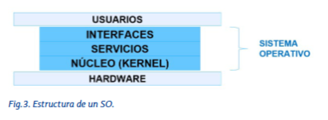
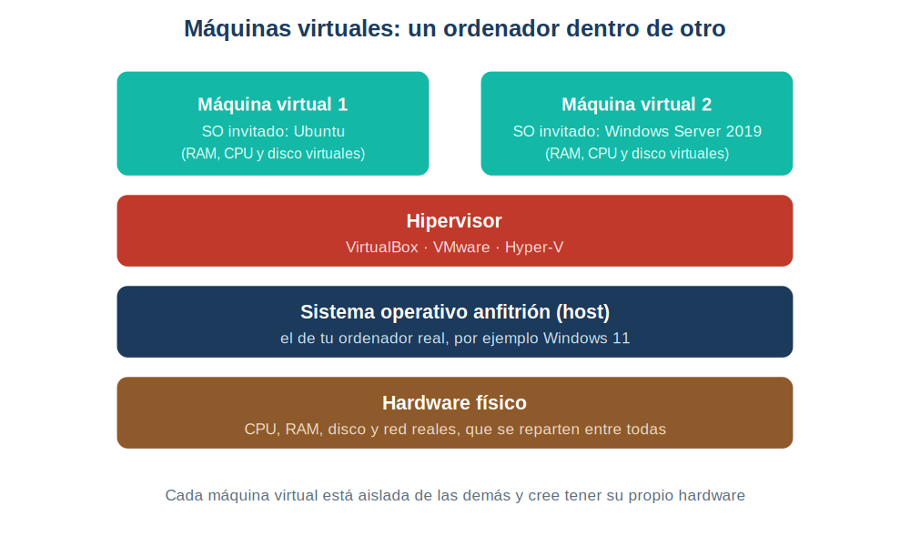

# Tema 3 — Los sistemas operativos

---

## Índice

1. [Introducción](#1-introducción)
2. [Qué hay dentro de un sistema operativo](#2-qué-hay-dentro-de-un-sistema-operativo)
3. [Estructuras y arquitecturas (para reconocer)](#3-estructuras-y-arquitecturas-para-reconocer)
4. [Funciones: qué hace el SO y dónde se ve](#4-funciones-qué-hace-el-so-y-dónde-se-ve)
5. [Tipos de sistemas operativos](#5-tipos-de-sistemas-operativos)
6. [La línea de comandos](#6-la-línea-de-comandos)
7. [Máquinas virtuales](#7-máquinas-virtuales)
8. [Licencias](#8-licencias)
---

## 1. Introducción

El sistema operativo (SO) es el software que hace de intermediario entre el hardware del ordenador, los programas y los usuarios. Aunque hoy existen muchísimos sistemas operativos, sus fundamentos son los mismos desde hace décadas.

En este tema vemos cómo está organizado un SO por dentro (estructura y arquitectura), qué hace (funciones), cómo se clasifican, cómo nos comunicamos con él (línea de comandos), qué es una máquina virtual (lo veremos en el siguiente tema) y qué licencias existen.

## 2. Estructura de un sistema operativo

Un SO se reparte el trabajo en tres piezas. Las aplicaciones nunca tocan el hardware directamente: siempre pasan por el SO.

| Pieza | Qué es | Dónde lo ves en Windows |
|---|---|---|
| Núcleo (kernel) | Lo único que toca el hardware | No se ve: trabaja por debajo |
| Servicios | Lo que el SO ofrece: archivos, red, procesos, seguridad... | `services.msc` (lista de servicios) |
| Interfaces | La forma de hablar con el SO | El escritorio (GUI) y `cmd` (CLI) |

**Pruébalo:** dos interfaces, el mismo servicio.
1. Con el Explorador de archivos, crea una carpeta en el escritorio (interfaz gráfica).
2. Abre `cmd` y escribe: `cd %USERPROFILE%\Desktop` y después `mkdir PruebaCLI` (línea de comandos).
3. Has pedido lo mismo al servicio de archivos de dos maneras distintas.

## 3. Tipos de estructuras de sistemas operativos

Según cómo se ordenen núcleo, servicios e interfaces, hay varios modelos:

| Estructura | Idea en una frase |
|---|---|
| Monolítica | Todo el SO es un único bloque (Linux, UNIX clásico) |
| Jerárquica | El SO se divide en niveles, y cada uno solo habla con el de arriba y el de abajo |
| En anillos | Como la jerárquica, con el kernel en el centro, que es lo más protegido |
| Cliente-servidor | Unos equipos ofrecen servicios y otros los usan |
| Virtualizada | Un ordenador simulado dentro de otro |

> Las estructuras **no son excluyentes**, porque describen cosas distintas. Tus máquinas virtuales de Windows Server de la práctica del Tema 2 son a la vez **cliente-servidor** (una hace de servidor y otra de cliente) y **virtualizadas**.

---

## 4. Arquitectura de un sistema operativo

Cada SO basa su funcionamiento en una arquitectura. Estas son las más conocidas, ordenadas de más antigua a más moderna:

| Arquitectura | Característica principal |
|---|---|
| Por lotes | Los trabajos se ejecutan uno detrás de otro |
| Por lotes con programación | Evolución de la anterior, con el procesador más libre |
| Tiempo compartido | La CPU se reparte entre usuarios y tareas (lo que hacen Windows y Linux hoy) |
| Distribuido (clúster) | Varios ordenadores (nodos) funcionando como uno solo |

---

## 5. Funciones de un sistema operativo

Las funciones del SO son de **control** (gestionar los recursos) o de **explotación** (mantener, optimizar y automatizar). Lo útil es saber qué herramienta de Windows muestra cada una:

### 5.1. Funciones de control

| Función | Tipo | Dónde se ve en Windows | Cómo abrirlo |
|---|---|---|---|
| Procesos, CPU y memoria | Control | Administrador de tareas | `Ctrl + Mayús + Esc` |
| Dispositivos y controladores | Control | Administrador de dispositivos | `Win + R` → `devmgmt.msc` |
| Seguridad y permisos | Control | Propiedades de una carpeta → Seguridad | Clic derecho |
| Diagnóstico y rendimiento | Explotación | Visor de eventos | `Win + R` → `eventvwr` |
| Actualizaciones | Explotación | Windows Update | Configuración |
| Tareas automáticas | Explotación | Programador de tareas | `Win + R` → `taskschd.msc` |
| Archivos y copias | Explotación | Explorador de archivos | `Win + E` |

**Pruébalo:** crear y terminar un proceso.
1. Abre el **Bloc de notas**.
2. Abre el **Administrador de tareas** y localiza "Bloc de notas" en la pestaña de procesos. Fíjate en cuánta CPU y memoria usa.
3. Haz clic derecho sobre él → **Finalizar tarea**. Has terminado un proceso.
4. Abre el **Visor de eventos** (`eventvwr`) → Registros de Windows → Sistema. Ahí queda el historial de lo que le ha pasado al equipo.

---

## 5. Clasificación de sistemas operativos

Un mismo SO se puede clasificar de varias formas a la vez:

| Criterio | Tipos | Ejemplo |
|---|---|---|
| Usuarios | Monousuario / multiusuario | MS-DOS (uno solo) / Windows Server, que admite varios usuarios a la vez por escritorio remoto |
| Tareas | Monotarea / multitarea | MS-DOS (una a la vez) / Windows y Linux (varias, como ves en el Administrador de tareas) |
| Procesadores | Uniprocesador / multiprocesador | Una CPU / varias CPU o núcleos (tus VM tienen 2 CPU) |
| Servicios | Centralizado / distribuido | Un único servidor / un clúster de nodos |
| Ejecución | Instalable / ejecutable (live) | Windows instalado en el disco / Ubuntu arrancado desde USB sin instalar |
| Dispositivo | Servidor / estación de trabajo / móvil | Windows Server / Windows 11 / Android |

Un SO **ejecutable (live)** es el que se arranca desde un medio extraíble sin tocar el disco duro. Es muy útil para probar un sistema, recuperar un equipo o trabajar de forma temporal. Un ejemplo típico es Ubuntu, que al arrancar permite elegir entre "Probar Ubuntu" e "Instalar Ubuntu".

---

## 6. Comunicación con el sistema operativo

Nos comunicamos con el SO a través de sus interfaces:

| Interfaz | Cómo se usa | Ventaja |
|---|---|---|
| CLI (línea de comandos) | Se escribe una orden de texto y se pulsa Intro | Muy eficiente y consume pocos recursos, porque no necesita entorno gráfico |
| GUI (entorno gráfico) | Ventanas, iconos y ratón | Más intuitiva |

Además de la interfaz de usuario, los programas hablan con el SO mediante **API**: conjuntos de funciones que el SO ofrece a las aplicaciones.

### 6.1. Símbolo del sistema (cmd)

La **CLI** es la forma de manejar el SO escribiendo órdenes. Consume muy pocos recursos y permite automatizar tareas, así que es la herramienta de trabajo habitual en servidores. En Windows es `cmd` (Símbolo del sistema); en Linux, el terminal.

| Comando | Qué hace | En Linux |
|---|---|---|
| `cd` | Moverse entre carpetas | `cd` |
| `dir` | Ver el contenido de una carpeta | `ls` |
| `hostname` | Ver el nombre del equipo | `hostname` |
| `ipconfig` | Ver la configuración de red | `ip a` |
| `tasklist` | Ver los procesos en ejecución | `ps` / `top` |
| `taskkill` | Terminar un proceso | `kill` |
| `chkdsk` | Buscar fallos en el disco | `fsck` |
| `robocopy` | Copiar archivos | `rsync` / `cp` |
| `shutdown` | Apagar el equipo | `shutdown` |
| `format` | Formatear una unidad | `mkfs` |

> Algunas tareas que cambian el sistema solo funcionan si abres `cmd` **como administrador** (clic derecho → Ejecutar como administrador). **No pruebes `format` ni `chkdsk /f` sin saber qué unidad estás tocando**: `format` borra una unidad entera.

**Pruébalo:** manejar procesos desde la consola.
1. Abre `cmd` y escribe `hostname` y `ipconfig`. Anota el nombre y la IP de tu equipo.
2. Abre el Bloc de notas.
3. En `cmd`: `tasklist | findstr notepad`. Verás el proceso del Bloc de notas.
4. Termínalo con `taskkill /IM notepad.exe`. El Bloc de notas se cierra.

---

## 7. Máquina virtual

Una máquina virtual (VM) es un ordenador simulado por software dentro de otro. Tiene su propio SO, aislado del resto, y cree que tiene su propia memoria, disco y red, aunque los toma prestados del equipo real.

| Término | Significado |
|---|---|
| Host (anfitrión) | Tu ordenador real y su SO |
| Guest (invitado) | El SO que corre dentro de la VM |
| Hipervisor | El programa que crea y gestiona las VM: VirtualBox, VMware, Hyper-V |

Al crear una VM en VirtualBox, estos son los parámetros que siempre te piden:

| Parámetro | Ejemplo (el de nuestras prácticas) |
|---|---|
| RAM | 2 GB |
| CPU | 2 |
| Disco | 50 GB |
| Red | Adaptador puente |

Y la red, la parte que más confunde:

| Modo de red | Qué consigue |
|---|---|
| NAT (el de por defecto) | La VM sale a Internet, pero otros equipos no la ven |
| Adaptador puente | La VM aparece en la red como un equipo más, y por eso se pueden conectar entre ellas |

---

## 8. Licencias de los sistemas operativos

Un SO puede ser **propietario** (se paga una licencia de uso, sin acceso al código) o **libre** (código disponible para usarlo, modificarlo y distribuirlo).

| Licencia | Cómo es |
|---|---|
| OEM | Asociada a un equipo: viene con el PC nuevo, y no se puede vender ni ceder |
| Retail | Se valida con un número de serie y se puede pasar a otro equipo (por eso es más cara) |
| Por volumen | Un acuerdo para muchos equipos de una organización: descuentos y activación sencilla |
| Libre | Código abierto: se puede usar, modificar y redistribuir (Ubuntu) |

| | Windows | Ubuntu |
|---|---|---|
| Coste | Licencia de pago | Gratuito |
| Software | La mayoría de programas están hechos para Windows | Algunos programas no tienen versión para Linux |
| Seguridad | Principal objetivo del malware por su cuota de mercado | Recibe menos ataques, pero también tiene vulnerabilidades |

**Pruébalo:** averigua qué sistema tienes y cómo está licenciado.
1. `Win + R` → `winver`: muestra la versión y la edición de Windows.
2. En `cmd`: `slmgr /dli` muestra la información de la licencia instalada.
3. Anota la edición y el estado de la licencia.

---

## Resumen del tema

| Tema | Lo que hay que saber hacer |
|---|---|
| Piezas del SO | Distinguir núcleo, servicios e interfaces (GUI y CLI) |
| Estructuras y arquitecturas | Reconocer los nombres, sin profundizar |
| Funciones | Saber qué herramienta de Windows muestra cada una |
| Procesos | Verlos y terminarlos desde el Administrador de tareas y desde `cmd` |
| Línea de comandos | `cd`, `dir`, `hostname`, `ipconfig`, `tasklist`, `taskkill`, y abrir `cmd` como administrador |
| Máquinas virtuales | Crear una con RAM, CPU, disco y red; saber la diferencia entre NAT y puente |
| Licencias | Diferenciar OEM, retail, volumen y libre, y saber consultar la propia con `winver` y `slmgr` |

